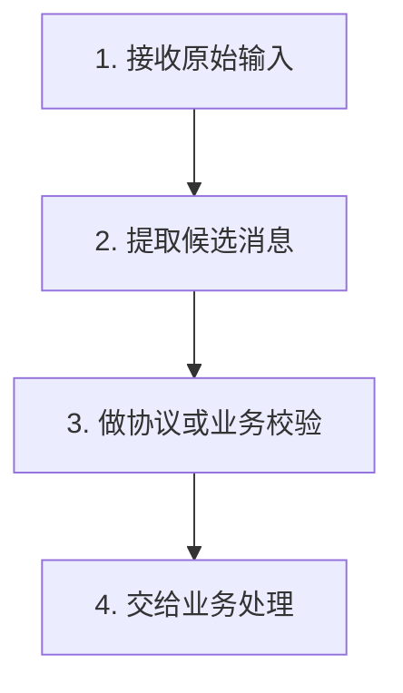

# Problem Learning Coach

> 把一次技术问题、项目理解或代码阅读，沉淀成新人真的看得懂、能复用、不会污染项目的学习材料。

`problem-learning-coach` 是一个面向中文技术学习的 Codex Skill。它的核心不是替你盲改代码，而是先认真查阅项目，再把问题拆成原理、项目真实链路、设计取舍、核心代码注释、最小化 demo、测试或考察问答，帮助学习者建立可迁移的理解。

它适合这些场景：

- 看不懂项目里某段代码、接口、配置、协议解析、异步链路或架构设计。
- 想把一个 bug、一次修复、一次项目分析转成可复习的学习文档。
- 想让 AI 用新手友好的中文讲清楚代码、API、运行原理、设计模式或业务链路。
- 想在学完后让 AI 提问，检查自己是不是真的理解了。
- 想对整个项目做分阶段分析，并在项目模式里做架构考察。

## 核心原则

这个 Skill 的底层态度很明确：

- 先查阅，再解释：不暗猜接口、调用链、业务含义或配置来源。
- 先确认，再深入：学习 demo 必须等用户确认学习重点后再写。
- 只沉淀文档，不污染源码：学习 demo 是 Markdown 里的完整参考图纸，不是真实创建的 demo 工程。
- 尊重项目现状：优先复用当前项目的语言、版本、框架、目录、配置和命名风格。
- 讲清边界：不仅讲“怎么做”，还讲“哪里做足了、哪里只是阶段性妥协、后续怎么演进”。
- 主动验证文档变更：确认 Markdown 文件存在、内容是追加而不是误删，demo 没有落成真实工程文件。

## 模式总览

`SKILL.md` 现在有五类主要工作方式：学习模式、讲解模式、项目模式、测试模式、考察模式。入口优先级由 `SKILL.md` 的 `Mode Routing` 控制。

| 用户说法 | 执行模式 | 默认交付位置 | 核心行为 |
| --- | --- | --- | --- |
| `走学习SKILL`、`用学习SKILL讲一下这个问题`、未声明特殊模式 | 学习模式 | `docs/learn/LyyyyMMdd(主题).md` | 分阶段生成学习文档，先讲原理，再等用户确认 demo 重点 |
| `启动讲解模式`、`讲解模式`、`用学习SKILL讲解一下` | 纯讲解模式 | `docs/explain/[E]yyyyMMdd-讲解XXXX.md` | 用读者优先的中文解释代码、原理、架构、对比或文档，不走学习 demo 流程 |
| `学习模式 + 讲解模式`、`按学习文档结构写，但是语言走讲解模式` | 学习模式融合讲解风格 | `docs/learn/LyyyyMMdd(主题).md` | 保留学习模式阶段、路径和 demo 规则，只把写法变得更像清晰讲解文章 |
| `项目模式`、`用学习SKILL走项目模式` | 项目模式 | `doc/project/PyyyyMMdd(<项目或模块名>分析).md` | 读取 `references/project-mode.md`，按项目分析阶段理解整个项目或模块 |
| `项目模式 + 讲解模式`、`这个项目用讲解模式讲解一下` | 项目模式融合讲解风格 | `doc/project/PyyyyMMdd(<项目或模块名>分析).md` | 保留项目模式阶段门禁和结构，用更顺滑的中文叙事讲项目 |
| `测试模式`、`学习SKILL测试模式`、`测一下我刚学的` | 学习测试模式 | 默认记录到 `docs/learn/tests/[T]yyyyMMdd-XXXX-测试记录.md` | 围绕学习文档或刚学主题出 5 题，活跃轮次内绝对只读 |
| `考察模式`、`学习SKILL考察模式`、`项目考察模式` | 项目考察模式 | 退出后追加到 `doc/project/PyyyyMMdd(<项目或模块名>分析).md` | 围绕整个项目核心逻辑和架构出 5 题，活跃轮次内绝对只读 |

如果用户只说 `你考我一下` 或 `你问我一下`，Skill 不会同时进入测试和考察。它会先看当前上下文：

- 当前在 `docs/learn/` 学习文档、局部学习主题或最小化 demo 附近：进入学习测试模式。
- 当前在 `doc/project/` 项目分析、项目模式或系统架构理解附近：进入项目考察模式。
- 无法判断时，默认更偏向项目考察；只有范围仍不清楚才问一个简短确认。

## 学习模式

学习模式是默认主流程，适合把一个局部技术点讲透，并沉淀到 `docs/learn/`。

### 阶段一：讲解原理

AI 会先只读项目，查入口、配置、调用链、核心类、测试或文档，然后在学习 Markdown 里解释：

- 一句话主题。
- 这个问题在当前项目里是什么。
- 架构、数据流或调用链。
- 易踩坑和优秀实践。
- 潜在不足与演进方向。
- 类似设计推荐。
- 核心代码以及中文前置注释。
- 接口或运行说明。

阶段一最后必须停在 `学习重点确认`。AI 会给出 2-5 个具体学习方向，等待用户选择。用户也可以说先到这里，不继续 demo。

### 阶段二：学习最小化 demo

只有当用户明确确认学习重点后，AI 才会在同一份学习文档里追加：

```markdown
## 10. 最小化demo（关于XXX）
```

这个 demo 是一份“能手动复刻的工程图纸”，但只存在于 Markdown 代码块中。它必须包含：

- 当前项目技术栈和 demo 完整性说明。
- `行业及企业级可信规则边界判断（先把当前的差距盘清楚）`。
- demo 架构图。
- 构建或配置文件内容。
- 源码文件内容。
- 一个请求、客户端调用或输入样例。
- 手动运行命令。
- 预期输出。
- demo 与原项目的对应关系。
- 做足的地方和不足或边界。

重要约束：

- 不创建真实 demo 目录。
- 不修改项目源码、配置、测试、脚本、数据库迁移或运行文件。
- 不实际运行、编译、测试或脚手架化 demo。
- 所有 demo 文件路径都以 `所属路径：...` 标在代码块上方。
- 每一行有效代码、配置、命令或示例输入，都要在上一行写中文注释，解释这一行做什么、为什么需要、删掉会怎样。

### 阶段三：追加学习最小化 demo

用户说 `追加学习 XXX` 后，AI 会回到同一份学习文档末尾继续追加新章节：

```markdown
## N. 追加学习：XXX
## N+1. 最小化demo（关于XXX）
```

追加学习不能覆盖、合并或重写之前的解释和 demo，除非用户明确要求清理。

## 讲解模式

讲解模式来自 `references/explain-mode.md`。它解决的是另一类需求：用户不一定想要完整学习文档和最小化 demo，只是想让 AI 把代码、原理、架构、对比或文档写得更像一个耐心工程师的讲解。

讲解模式有三种用法。

### 纯讲解模式

触发示例：

```text
启动讲解模式，讲一下这个类为什么这样设计
用学习SKILL讲解一下 HashMap 扩容原理
讲解模式，重写这份文档，让新人能看懂
```

默认输出到：

```text
docs/explain/[E]yyyyMMdd-讲解XXXX.md
```

纯讲解模式不会创建或更新 `docs/learn/`，除非用户明确说要转成学习文档。对于非常小的问题，比如一行报错、两行代码或一个很局部的语法点，可以只在聊天里解释，并明确说明为了避免文档噪音而跳过落盘。

### 融合到学习模式

触发示例：

```text
学习模式 + 讲解模式，讲一下这个问题
按学习文档结构写，但是语言走讲解模式
```

这时学习模式仍然是主流程。也就是说：

- 路径仍然是 `docs/learn/`。
- 阶段一、阶段二、阶段三仍然有效。
- 学习重点确认仍然必须卡住。
- 最小化 demo 规则和企业级边界判断仍然有效。

讲解模式只负责把表达变得更适合新人阅读。

### 融合到项目模式

触发示例：

```text
这个项目用讲解模式讲解一下
学习SKILL 项目模式 + 讲解模式
```

这时项目模式仍然是主流程。也就是说：

- 路径仍然是 `doc/project/`。
- 项目模式阶段门禁仍然有效。
- Stage 1 只能讲宏观拓扑。
- Stage 2 只能讲领域模块。
- Stage 3 的业务场景、方法级调用链、`Class.method()` 细节，必须等 Stage 2 完成并且用户回复 `继续` 后才能展开。

如果讲解过程中想提前提到 Stage 3 细节，应该写：

```text
这个细节属于阶段三，等你回复“继续”后再展开。
```

## 项目模式

项目模式适合整项目、整系统或整模块分析。触发后不执行普通学习流程，也不写 `docs/learn/`。

它会读取：

```text
references/project-mode.md
```

默认输出到：

```text
doc/project/PyyyyMMdd(<项目或模块名>分析).md
```

项目模式按阶段推进：

1. 阶段一：宏观拓扑，理解系统边界、入口、外部依赖、运行关系。
2. 阶段二：领域模块，理解主要模块职责、关键文件、状态节点和数据对象。
3. 阶段三：业务场景驱动理解，必须等用户回复 `继续` 后才能进入，才允许展开场景地图和方法级调用链。

项目模式的重点是理解项目，不是生成局部 demo。如果用户想基于某个局部继续做可手动复刻的 demo，需要回到学习模式。

## 测试模式

测试模式属于学习 Skill 本体，用来检查刚刚学过的局部内容。

它会读取：

```text
references/rules/learning-test-mode.md
```

进入测试模式后，一轮固定 5 个问题。第一轮回复必须只输出第 1 个问题，然后停住等用户回答。

每次用户回答后，AI 才能输出：

- `评分`：1-10 分。
- `评价（足和不足）`：指出理解到位和遗漏的地方。
- `参考答案`：基于学习文档或当前学习主题给出新手友好的答案。
- 下一道单独问题。

活跃测试轮次内是绝对只读沙盒：

- 不修改任何文件。
- 不修改学习文档。
- 不创建测试记录文件。
- 不因为用户中途问 bug、修复、重构或文档调整就切换到编辑模式。

退出测试后，默认记录写到单独文件：

```text
docs/learn/tests/[T]yyyyMMdd-XXXX-测试记录.md
```

只有用户明确要求“写回原学习文档”时，才可以追加到源学习文档，而且必须用 `<details>` 折叠块，避免污染可分享的学习正文。

## 考察模式

考察模式是项目模式的子模式，用来检查对整个项目核心逻辑、架构边界和设计取舍的理解。它不是测试某个局部 demo。

它会读取：

```text
references/project-mode.md
references/rules/inspection-mode.md
```

进入考察模式后，一轮固定 5 个深度问题。第一轮回复必须只输出第 1 个问题，然后停住等用户回答。

问题覆盖范围包括：

- 项目业务目标和系统边界。
- 核心业务闭环。
- 模块拆分和依赖耦合。
- 核心对象和数据流。
- 状态流转。
- 关键状态节点的并发或一致性风险。
- 外部系统、设备、客户端或异步链路。
- 选型取舍。

活跃考察轮次内同样是绝对只读沙盒，不写任何物理文件。退出考察模式后，才可以把已回答、未跳过的问题按规则追加到当前项目分析文档的 `# 考察模式` 章节。

持久化规则有分数门槛：

- 8 分及以上：写入问题、用户回答、评分、评价和参考答案。
- 8 分以下：只写问题和参考答案，不把薄弱回答写入项目分析文档。

## 学习文档结构

普通学习模式的文档大致长这样：

```markdown
# LyyyyMMdd(主题)

> 目标读者：需要理解该局部机制的开发者
> 阅读目标：快速理清数据流程，在需要时作为干净的工程参考图纸

## 1. 一句话讲清楚
## 2. 这个问题在项目里是什么
## 3. 架构和流程
## 4. 易踩坑和优秀实践（✔）
## 5. 潜在不足与演进（×）
## 6. 类似设计推荐
## 7. 核心代码以及注释
## 8. 接口或运行说明
## 9. 学习重点确认

## 10. 最小化demo（关于XXX）
## 10.1 核心技术栈与完整性说明
## 10.2 行业及企业级可信规则边界判断（先把当前的差距盘清楚）
## 10.3 基于 Demo 的拓扑架构图（Mermaid）
## 10.4 核心代码工程化文件展示（含逐行前置注释）
## 10.5 手动运行命令、预期结果和原项目对应关系
## 10.6 做足的地方和不足
## 11. 下次遇到怎么判断

## 12. 追加学习：YYY
## 13. 最小化demo（关于YYY）
```

`易踩坑和优秀实践（✔）` 里的 `✔` 表示当前项目已经处理得好，值得保留；不是每个坑都是缺陷。

`潜在不足与演进（×）` 里的 `×` 表示需要补强或未来演进方向；不是简单批评当前实现。

## 企业级 demo 判断

最小化 demo 不能只给玩具代码。写 demo 前必须先判断当前项目在这个学习点上是否符合相关行业和企业级可信边界，并明确写出：

```text
符合 / 部分符合 / 不符合
```

例如高频数据链路、实时流、WebSocket 批量推送、MQ 缓冲、RTCM/NMEA/IoT 设备接入等主题，至少要判断：

- 生产者和消费者并发是否安全。
- 队列结构是否线程安全。
- 队列是否有容量边界。
- 溢出策略是丢旧、拒新、阻塞、降级还是落持久化中间件。
- 队列长度、丢弃数量、刷新间隔、批大小和错误数量是否可观测。
- 如果消息不能丢，是否应该使用可靠中间件、持久化、幂等、重试或 offset 追踪。

协议和设备接入类主题还要判断：

- 字节流读取、候选帧或候选行提取、协议校验、业务解码是否分层。
- 是否处理半包、粘包、畸形输入、超长缓冲、会话清理。
- 是否校验起始标记、长度、分隔符、checksum 或 CRC、字段数量、字段格式和消息类型。
- 是否保留 session、来源端口、来源名称、序列、日志或统计等上下文。

如果项目已经做得好，demo 不能把关键安全边界简化掉。  
如果项目只是部分符合或不符合，demo 要先忠实展示当前项目思路，再补 `企业级补强方案`。

## Mermaid 规则

文档可以使用 Mermaid，但要保持稳定、简单、可渲染：

- 优先使用 `graph TD` 或 `sequenceDiagram`。
- 中文节点使用 `A["中文说明"]`。
- 一条连接写一行。
- 避免复杂嵌套、花哨括号和过密链式写法。
- 图太复杂时，改用纯文本调用链。

推荐写法：



## 如何使用

把这个 Skill 放在 Codex 可发现的技能目录中，例如：

```text
~/.codex/skills/problem-learning-coach/
```

目录中至少需要：

```text
problem-learning-coach/
├── SKILL.md
└── references/
    ├── explain-mode.md
    ├── project-mode.md
    └── rules/
        ├── learning-test-mode.md
        └── inspection-mode.md
```

常用请求示例：

```text
用学习SKILL讲一下这个 Kafka 消费链路，生成学习文档。
```

```text
学习 8082 NMEA 切行和 GSV 解码。
```

```text
追加学习 WebSocket 批量推送。
```

```text
启动讲解模式，讲一下这个模块为什么要拆成 Controller、Service、Repository。
```

```text
用学习SKILL走项目模式，分析这个项目。
```

```text
测试模式，测一下我刚学的。
```

```text
考察模式，检查我对整个项目架构的理解。
```

## 维护说明

当前仓库里的 `README.md` 是给人看的能力说明；真正驱动 Codex 行为的是 `SKILL.md` 和 `references/` 下的规则文件。

更新顺序建议：

1. 先改 `SKILL.md` 或对应 `references/` 规则。
2. 再同步更新 `README.md` 的模式说明、路径说明和持久化规则。
3. 检查 README 是否错误承诺了 `SKILL.md` 没有实现的行为。
4. 尽量避免把完整规则重复塞进 README；README 只保留使用者需要知道的能力地图。

## License

MIT License
