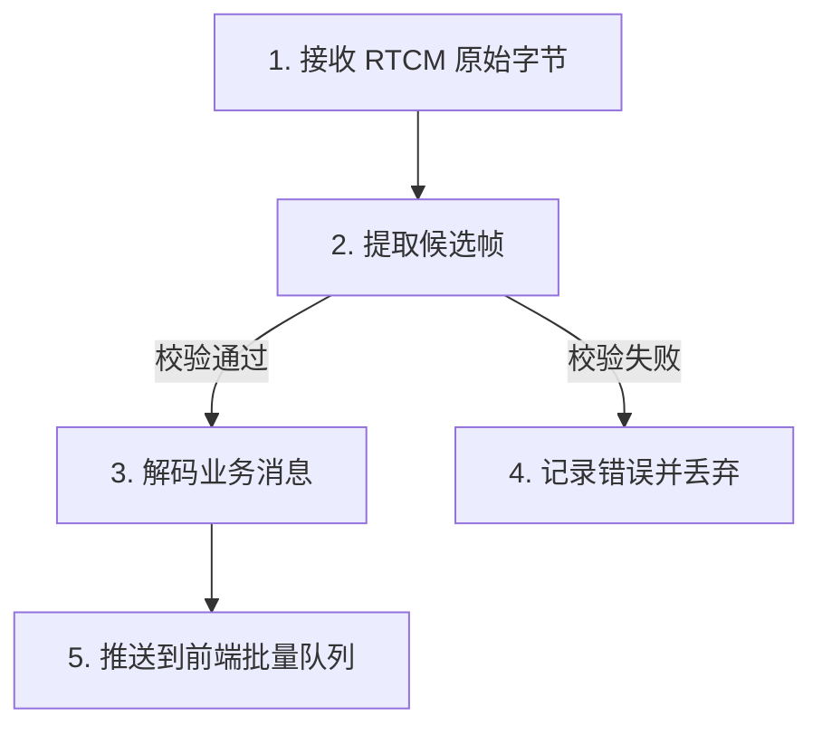
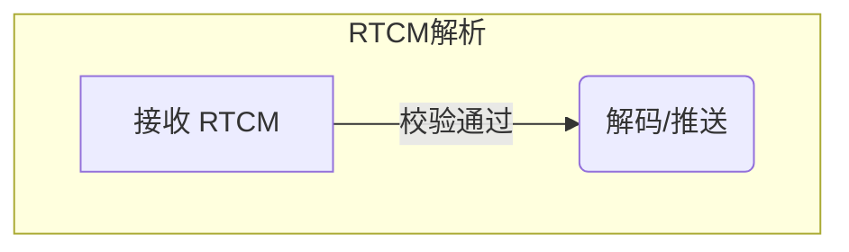

# Problem Learning Coach

## Goal

Turn a concrete problem into a learning document the user can actually understand and reuse. The normal output of this skill is a Markdown document, not only an inline chat explanation.

This skill is domain-agnostic. Use it for MQTT, Kafka, Redis, HTTP, WebSocket, databases, frontend code, scheduled jobs, parsing logic, performance problems, architecture questions, bug fixes, or any other technical topic. First identify the actual topic from the user's request and the current codebase; do not inherit the topic from the reference example.

## Mode Routing

This section has the highest priority in this skill. Apply it before `Hard Safety Rule`, `Execution Phases`, `Default Workflow`, `Output Shape`, and `Minimal Demo Rules`.

### Active Submode Permission Boundary

When `测试模式（学习本体）` or `考察模式（项目模式子模式）` is active, that submode's read-only sandbox assertion has priority over this skill's general ability to discuss bugs, fixes, refactors, demos, or documentation. Do not let a mid-round user request such as `这个 bug 怎么修`, pasted code, config changes, test fixes, or reference-answer corrections escape the active submode's permissions.

While either submode is active:

- Do not create, rewrite, patch, modify, format, move, delete, stage, commit, or otherwise change any physical file.
- Discuss bug/fix/code issues in chat only, or tell the user that real file edits require exiting the current test/inspection mode first.
- Do not silently switch from the active submode into implementation mode. A real edit is a separate request after the submode ends.
- Persistence records for test/inspection answers may be prepared in chat but must not be written to disk until the round has ended or the user explicitly asks to persist after exit.

### Ambiguous Trigger Arbitration Rule

When the user says `你考我一下` or `你问我一下`, these ambiguous triggers must be routed by current scope target before any other mode rule. Never choose both learning test mode and project inspection mode in the same turn. Never fuse the two modes.

Route in this exact priority order:

1. If the current conversation, newest user request, current document, or immediately previous action is about a local learning document under `docs/learn/`, a normal learning topic, a minimal demo, or a recently learned local concept, route to `测试模式（学习本体）`. Read and strictly follow `references/rules/learning-test-mode.md`.
2. Else if the current conversation, newest user request, current document, or immediately previous action is about a project analysis document under `doc/project/`, project mode, whole-project architecture, Stage 1/2/3 project analysis, or project-mode scenario/call-chain analysis, route to `考察模式（项目模式子模式）`. Read `references/project-mode.md` for context and strictly follow `references/rules/inspection-mode.md`.
3. Else if no local learning document scope is clear, route to `考察模式（项目模式子模式）` by default. The ambiguous phrase should test whole-project understanding unless a `docs/learn/` scope is clearly active.
4. If both a `docs/learn/` learning document and a `doc/project/` project-analysis document are visible in the conversation, the immediately previous user-facing task decides the scope. If the previous task was appending or discussing a learning document/demo, choose learning test mode. If it was appending or discussing project analysis, choose project inspection mode.
5. Ask a clarification question only when the current scope cannot be inferred from the conversation or files after a brief inspection. The clarification must be a single short question, and no test/inspection question may be asked until the user chooses the scope.

If the user does not name a mode, execute the normal Problem Learning Coach workflow in this `SKILL.md`.

### 讲解模式融合规则

讲解模式 is both a standalone workflow and a style/organization layer that can be fused into another mode.

First decide the primary workflow, then decide whether to apply explain-mode writing style:

1. If the user combines `讲解模式` with `项目模式`, such as `这个项目用讲解模式讲解一下` or `参考项目模式输出风格和组织的语言用讲解模式`, use project mode as the primary workflow. Read `references/project-mode.md` and preserve its stage gates, document path, required headings, and output structure. Also read `references/explain-mode.md` and apply its reader-first Chinese narrative style inside the project-mode structure. Under this fusion, the project-mode Stage Gate Rule is absolute: explain mode must not introduce Stage 3 scenario maps, scenario design analysis, or `Class.method()` call chains before Stage 2 is complete and the user confirms `继续`.
2. If the user combines `讲解模式` with the normal learning workflow, such as `使用学习SKILL 这个东西用学习模式融合讲解模式讲解一下`, use the normal Problem Learning Coach workflow in this `SKILL.md`. Preserve `docs/learn/`, the staged learning phases, learning-document structure, learning-focus confirmation, and minimal-demo rules. Also read `references/explain-mode.md` and apply its reader-first Chinese narrative style inside those sections.
3. If the user only asks for `启动讲解模式`, `讲解模式`, `学习SKILL讲解模式`, `学习skill explain mode`, `用学习SKILL讲解一下`, or asks for a reader-friendly explanation without requesting project mode or the staged learning workflow, use pure explain mode. Do not execute the normal Problem Learning Coach workflow, and do not create or update `docs/learn/` unless the user explicitly asks to turn the explanation into a learning document. Pure explain mode creates or updates a Markdown explanation document under `docs/explain/` by default, unless the lightweight chat-only exception in `references/explain-mode.md` applies.
4. In pure explain mode, read and follow `references/explain-mode.md` as the operative workflow. Let the user's requested topic decide the explanation shape: code usage, code design, principle/runtime, architecture/design pattern, comparison, or documentation rewrite. When the topic relates to the current workspace or recently inspected project files, ground the explanation in the current project's actual implementation instead of giving only a generic explanation.
5. In pure explain mode, use the explain-mode document path and filename rules from that reference: `docs/explain/[E]yyyyMMdd-讲解XXXX.md` unless the lightweight chat-only exception applies. A chat summary may accompany the file, but it does not replace the required document when a document is required.
6. In fused mode, explain mode changes writing style, reading path, evidence framing, and narrative organization only. It must not override the primary mode's required output path, stage gates, persistence rules, document headings, demo rules, or test/inspection behavior. When fused with project mode, keep narrative detail at the current stage's allowed granularity; if a detail belongs to Stage 3, write `这个细节属于阶段三，等你回复“继续”后再展开。` instead of leaking it early.

### 项目模式

When the user says `用学习SKILL走项目模式`, `学习SKILL 项目模式`, `学习skill project mode`, `项目模式`, or clearly asks this skill to analyze a whole project/system/module instead of producing a beginner learning document:

1. Do not execute the normal Problem Learning Coach workflow.
2. Do not create or update `docs/learn/`.
3. Read and follow `references/project-mode.md` as the operative workflow for this turn.
4. Treat `references/project-mode.md` as the imported original project skill. Ignore its YAML frontmatter as trigger metadata, but follow its body instructions exactly.
5. Use the project-mode document path and stage rules from that reference: `doc/project/PyyyyMMdd(<项目或模块名>分析).md`.
6. If any rule in the normal learning workflow conflicts with project mode, project mode wins for this turn.

### 测试模式（学习本体）

When the user says `学习SKILL测试模式`, `测试模式`, `学习测试模式`, `测一下我刚学的`, or when `Ambiguous Trigger Arbitration Rule` routes `你考我一下` / `你问我一下` to a `docs/learn/` learning scope:

1. Treat it as the normal learning skill's test mode, not as project-mode Inspection Mode.
2. Test the current learning document, latest relevant `docs/learn/LyyyyMMdd(...).md`, or recently discussed learning topic.
3. Do not execute project mode.
4. Do not read or write `doc/project/` unless the user explicitly switches to `考察模式` or `项目模式`.
5. Read and strictly follow `references/rules/learning-test-mode.md`.
6. On entering the mode, output only question 1, then stop and wait for the user's answer.
7. During the active test round, treat the mode as an absolute read-only sandbox. Do not modify any file, including the learning document itself.
8. Persist answered questions only according to `references/rules/learning-test-mode.md` after the round has ended or after an explicit post-exit persistence request. Default persistence must go to a separate `docs/learn/tests/[T]yyyyMMdd-XXXX-测试记录.md` file, not into the source learning document. Append into the source learning document only if the user explicitly asks, and then use the folded `<details>` format from the test-mode reference.

### 考察模式（项目模式子模式）

When the user says `学习SKILL考察模式`, `考察模式`, `项目考察模式`, `进入考察模式`, or when `Ambiguous Trigger Arbitration Rule` routes `你考我一下` / `你问我一下` to a `doc/project/` or default project-inspection scope:

1. Treat it as the project mode's Inspection Mode over the whole project, not as a learning-document test.
2. Do not execute the normal Problem Learning Coach workflow.
3. Read `references/project-mode.md` for the surrounding project-analysis context rules and document path rules.
4. Read and strictly follow `references/rules/inspection-mode.md`.
5. If a `doc/project/PyyyyMMdd(<项目或模块名>分析).md` analysis document already exists for the current project/context, use it as the grounding document for questions and persistence.
6. If no project-analysis document exists or the analyzed project/module is ambiguous, inspect the current project enough to ask a grounded first question, and ask concise clarification only when the target project cannot be safely identified.
7. On entering the mode, output only question 1, then stop and wait for the user's answer.
8. During the active inspection round, treat the mode as an absolute read-only sandbox. Do not modify any file, including the project analysis document itself.
9. Persist answered questions only according to `references/rules/inspection-mode.md` after the round has ended or after an explicit post-exit persistence request; do not write project inspection records into `docs/learn/`.

## Hard Safety Rule

When executing this skill, do not modify the current project except for creating or appending the learning Markdown document under `docs/learn/` or another user-specified documentation path. Do not edit source code, configuration, tests, build files, scripts, database migrations, assets, or runtime files. Do not create demo project directories or standalone demo files. If the user asks for a real code change, stop using this learning skill for that action and treat it as a separate implementation request.

Write like a patient senior engineer teaching a new graduate:

- Use simple words first.
- Explain jargon before using it heavily.
- Prefer concrete examples over abstract theory.
- Connect every design choice back to the user's current project or scenario.
- Do not only give the final answer; teach the thinking path.

## Reference Loading

Default behavior:

- Do not read the full reference example by default.
- Use the rules in this `SKILL.md` first.
- Read the reference only when the user asks for a full learning document, asks to match a previous learning-doc style, asks for a WebSocket/realtime-streaming example, or when a concrete example is needed and the core rules are not enough.

Reference example:

```text
references/websocket-realtime-learning-example.md
```

Use this reference as a style and structure example only. Do not assume the target problem is WebSocket, RTCM, Java, Spring Boot, or realtime streaming unless the current user request or codebase confirms it.

Mode references:

```text
references/project-mode.md
references/explain-mode.md
references/rules/learning-test-mode.md
references/rules/inspection-mode.md
references/templates/call-chain-template.md
```

Load these only when `Mode Routing` selects or fuses explain mode, project mode, learning test mode, or project inspection mode.

## Execution Phases

Always tell the user which learning phase is being executed before doing substantial work. Use these three phases:

1. `阶段一：讲解原理`
   - Explain the original project/problem first: concept, real project design, data flow/call chain, tradeoffs, core code, and how to judge similar problems.
   - End this phase with `学习重点确认`, asking the user what they want to learn through a complete minimal demo appended to the same learning document.
   - Tell the user they can continue to phase two, choose a focus, or stop the learning flow.

2. `阶段二：学习最小化demo`
   - Start only after the user confirms a learning focus, such as `学习 8082 NMEA 切行和 GSV 解码`.
   - Add the section `最小化demo（关于XXX）`, replacing `XXX` with the confirmed focus.
   - Append a complete minimal demo section to the same Markdown learning document, following the Minimal Demo Rules.
   - Do not modify the current project source code, do not create a demo project directory, and do not create standalone demo files.
   - End by telling the user they can stop, ask questions, or say `追加学习 XXX` to enter phase three.

3. `阶段三：追加学习最小化demo`
   - Start when the user says `追加学习 XXX` or clearly asks to continue with another learning topic in the same document.
   - Append a new learning section for `XXX`, then append `最小化demo（关于XXX）` in the same Markdown learning document.
   - Do not modify the current project source code, do not create a demo project directory, and do not create standalone demo files.
   - Do not overwrite previous explanations or demos.
   - After each additional demo, tell the user they can stop or continue with another `追加学习 XXX`.

The user may stop at any phase. If the user says `停止`, `先到这里`, `不用继续`, or an equivalent phrase, stop the staged learning workflow and summarize what has already been completed. Do not continue into the next phase unless the user asks.

## Default Workflow

1. Restate the problem in plain Chinese:
   - Say what the user is seeing.
   - Say what they probably care about.
   - Separate symptom, cause, and solution.

2. Identify the current topic and missing facts:
   - Determine whether the topic is MQTT, Kafka, Redis, HTTP, WebSocket, database, frontend, scheduling, parsing, performance, or something else.
   - Inspect available code/config/docs first when the workspace is available.
   - Ask concise clarification questions only when a safe learning demo or explanation depends on missing facts, such as Java version, framework version, broker/database choice, runtime environment, dependency style, or whether the demo should be pure Java or framework-based.

3. Inspect the project when code is available:
   - Find entrypoints, configs, controllers, services, utility classes, tests, and docs.
   - Trace the real call chain before explaining.
   - Prefer actual code references over guessing.
   - Read project files only; do not edit project files while executing this learning skill.

4. Explain the mental model:
   - Use one short analogy only if it helps.
   - Define important terms.
   - Explain what happens before, during, and after the key operation.

5. Explain the project design:
   - What modules/classes are involved.
   - What each layer is responsible for.
   - How data flows between layers.
   - Where configuration lives.
   - What is synchronous, asynchronous, queued, batched, cached, persisted, or pushed.

6. Discuss tradeoffs:
   - Benefits of the current design.
   - Potential problems or limits.
   - When the design is good enough.
   - When to use a more advanced design.
   - Similar recommended patterns.

7. Show core code with comments:
   - Quote only the most important snippets.
   - Add Chinese comments that explain why each line exists.
   - Hard requirement: line comments must be written on the immediately preceding line of the code they describe; do not use same-line trailing comments.
   - Do not paste giant files.
   - Link to local files when possible.

8. Execute `阶段一：讲解原理` and ask for learning focus confirmation before appending the minimal learning demo:
   - Tell the user this is phase one before starting the explanation.
   - After completing the design explanation, flow/call-chain explanation, tradeoffs, and core code explanation, pause and ask the user what they want to learn deeply next.
   - Summarize 2-5 concrete learning focus options based on the project context, such as "Kafka raw data chain", "NMEA line parser", "WebSocket push", "RTCM frame parser", or "database connection config".
   - Wait for the user to confirm a specific focus, such as "学习 Kafka 原始数据链路" or "学习 8082 NMEA 切行和 GSV 解码".
   - Explicitly tell the user they may stop here instead of continuing to the demo phase.
   - Do not add the `最小化demo（关于XXX）` section until the user confirms the learning focus.
   - Once confirmed, append or complete the `最小化demo（关于XXX）` section for exactly that confirmed focus, replacing `XXX` with a short Chinese phrase derived from the user's confirmed learning topic.
   - If the user later says `追加学习 XXX`, continue in the same learning document when the context clearly refers to an existing document. Append a new learning section for `XXX`, then append the next section named `最小化demo（关于XXX）`; do not overwrite or replace previous learning sections or demos.

9. Execute `阶段二：学习最小化demo` and provide a complete minimal learning demo after confirmation:
   - Tell the user this is phase two before writing the demo.
   - This is required after the user confirms the learning focus, even when the real project cannot be run; use simulated/mock data when needed.
   - Keep it smaller than the real project.
   - Hard requirement: outside the learning Markdown document itself, do not modify any project file while executing this skill.
   - Hard requirement: append the demo only to the same Markdown learning document under `docs/learn/`; never change the current project source code for the demo.
   - Hard requirement: do not create a demo project directory, do not create standalone demo files, and do not add demo files anywhere in the repository.
   - Hard requirement: if the topic comes from an existing project, inspect that project's build/config files first and make the demo text use the same primary development language, language version, framework, and dependency style whenever possible.
   - Hard requirement: before writing the demo, judge whether the current project implementation for this exact demo focus satisfies enterprise-grade rules for that domain. Add the judgment result to the learning document.
   - Hard requirement: if the current project satisfies enterprise-grade rules, the demo must mirror the project's enterprise-grade design instead of simplifying away the important safety boundary. If the current project does not satisfy enterprise-grade rules, first write a demo that matches the current project so the user learns the real code, then add an enterprise-grade improvement section explaining how it should be done.
   - Hard requirement: every minimal demo must explicitly explain `做足的地方` and `不足或边界`. Do not present a simplified teaching demo as if it were production-grade.
   - Hard requirement: the demo must be complete enough for the user to manually create and run outside the current project. Include build/config file contents, source file contents, run commands, one request/client/example invocation, and expected output as Markdown code blocks.
   - Hard requirement: do not actually run, compile, test, scaffold, or validate the demo. Instead, include a `完整性说明` section that states the demo was not executed by Codex because this skill forbids modifying the current project or creating demo projects, and explain what command the user can run manually after copying the files to a separate folder.
   - Organize the demo in real development order so the user can manually create a separate learning project and copy/paste files step by step.
   - Do not collapse the demo into a single monolithic source file except for a tiny algorithm-only lesson with no meaningful project structure; in normal cases, show a small but real engineering layout with build file, configuration, entrypoint, model, service, and client/test files as code blocks in the document.
   - If the learning topic comes from an existing project, make the demo follow that project's design principles first: module boundaries, package naming, configuration style, dependency management, layering, naming conventions, and runtime entrypoints.
   - Put the exact file path or runtime location immediately above every code block, using labels such as `所属路径：...` or `所属位置：...`.
   - Include config, key classes/functions, interfaces, and a simple test/client.
   - Use detailed Chinese comments that explain what the line does, why it exists, and what may happen if it is removed or misconfigured.
   - In every minimal-demo code block, every code statement must have a Chinese comment; do not leave uncommented executable statements, declarations, configuration lines, or commands.
   - Hard requirement: every line comment must be placed on the immediately preceding line of the related code or configuration; do not write same-line trailing comments.
   - Add a small architecture diagram based on the demo itself before the code, preferably Mermaid when Markdown output supports it.
   - Follow `Mermaid Diagram Stability Rules` for every Mermaid diagram.
   - Explain how the user can manually run or call it outside the current project.
   - End by telling the user they can stop here, ask questions, or say `追加学习 XXX`.

10. End with a reusable checklist:
   - How to recognize this kind of problem next time.
   - What questions to ask.
   - What files to inspect.
   - What metrics/logs/status endpoints to check.
   - What knobs can be tuned.

## Output Shape

Prefer this structure for learning documents:

```markdown
# 标题

> 目标读者：
> 阅读目标：

## 1. 一句话讲清楚
## 2. 这个问题在项目里是什么
## 3. 架构和流程
## 4. 易踩坑和优秀实践（✔）
## 5. 潜在不足与演进（×）
## 6. 类似设计推荐
## 7. 核心代码以及注释
## 8. 接口或运行说明
## 9. 学习重点确认
## 10. 最小化demo（关于XXX）（用户确认学习主题后追加到本文档）
## 10.1 核心技术栈与完整性说明
## 10.2 行业及企业级可信规则边界判断（先把当前的差距盘清楚）
## 10.3 基于 Demo 的拓扑架构图（Mermaid）
## 10.4 核心代码工程化文件展示（含逐行前置注释）
## 10.5 手动运行命令、预期结果和原项目对应关系
## 10.6 做足的地方和不足
## 11. 下次遇到怎么判断

## 12. 追加学习：XXX（用户说追加学习后再补充）
## 13. 最小化demo（关于XXX）
```

Always create or update a Markdown learning document under `docs/learn/` unless the user gives another path. If `docs/learn/` does not exist, create it before writing the document. Use the filename format `Lyyyymmdd(文档学习什么).md`, where `yyyymmdd` is the current date and the parentheses contain a short Chinese learning topic, for example `docs/learn/L20260610(学习8080和8082数据获取).md`. A brief chat summary may accompany it, but it does not replace the document. The document must focus on the exact topic the user asked to learn, not on a canned example or prior reference topic.

Every learning document must include sections up through `学习重点确认` before asking the user what to learn deeply. Only append the `最小化demo（关于XXX）` section after the user confirms the learning focus, and replace `XXX` with the confirmed topic, such as `Kafka原始数据链路`, `8082 NMEA切行和GSV解码`, or `RTCM帧解析`. The demo may use simulated/mock data when real infrastructure, devices, brokers, databases, or third-party services are unavailable, but it must be represented entirely inside the Markdown document as complete file contents, commands, expected output, and original-project mapping. Do not create demo files or modify project files for the demo.

## Mermaid Diagram Stability Rules

When writing Mermaid diagrams in learning documents, minimal demos, or explain-mode fused outputs:

- Use only the stable flowchart forms `graph TD` or `graph LR`.
- Prefer `graph TD` for step-by-step processing and `graph LR` for left-to-right architecture/data-flow diagrams.
- Define every node with a short ASCII node ID and a quoted label, such as `A["1. 接收 MQTT 消息"]`.
- Wrap every label containing Chinese, spaces, punctuation, parentheses, slashes, colons, protocol names, API paths, or other special characters in double quotes.
- Connect nodes with plain `-->` only.
- If an edge needs a label, use only the Mermaid edge-label format `-->|描述|`, such as `A -->|写入队列| B`.
- Do not use mixed arrow styles such as `--描述-->`, `-.->`, `==>`, `---`, or chained syntax that combines several edge styles in one line.
- Do not use `subgraph`, `end`, `classDef`, `style`, click handlers, icons, HTML tags, raw Markdown links, or complex Mermaid features in learning diagrams unless the user explicitly asks for advanced Mermaid.
- Keep one connection per line. Do not write dense chains such as `A --> B --> C` when labels or Chinese text are involved; split them into separate lines.
- If the diagram becomes complex enough to require nested groups, replace it with a plain `text` call-chain diagram instead of risking Mermaid render failure.
- Prefer clear node labels over clever edge labels. When in doubt, put the explanation in the node label or in prose below the diagram.

Stable example:



Avoid:



Hard requirement for `易踩坑和优秀实践（✔）` and `潜在不足与演进（×）` sections:

- Keep these as two separate chapters and do not recreate a standalone `当前设计的好处` chapter:
  - `## 4. 易踩坑和优秀实践（✔）`: `✔` means these are technical points that are easy to misunderstand, easy to implement incorrectly, or likely to trigger bugs, but that the current project already handles well.
  - `## 5. 潜在不足与演进（×）`: `×` means these are real design boundaries and staged tradeoffs that may need strengthening as the system moves toward production or enterprise use.
- Chapter 4 must organically merge micro pitfall explanation with macro design strengths. In the `当前项目怎么处理` block, explain both the concrete class/method/configuration behavior and the broader design advantage it represents. Do not repeat a separate generic "current design benefits" chapter.
- Chapter 5 must evaluate shortcomings from industrial engineering angles when relevant, including high concurrency, enterprise-grade boundaries, reliability and recovery, traceability and auditability, observability and operations, security/trust boundaries, performance/resource boundaries, data consistency, idempotency, and maintainability. Explain these as staged compromises or evolution points, not as blanket condemnation.
- Do not present every pitfall as a project defect. If the current design is reasonable, put it in chapter 4 and explain why it is an excellent practice. If the current design works but lacks a stronger production boundary, put it in chapter 5 and explain the future evolution direction.
- Immediately under chapter 4, add a short legend explaining that `✔` means "处理得好 / excellent practice worth preserving".
- Immediately under chapter 5, add a short legend explaining that `×` means "需要补强 / staged limitation and future evolution direction".
- Do not add `✔` or `×` markers to every subsection title. The marker belongs only in the chapter title. Subsection titles should stay clean, for example:
  - `### 4.1 第一个坑：把 18080 当作 RTCM 数据端口`
  - `### 5.1 协议入口边界：RTCM analyzer 没有按 sourcePort=8080 显式过滤`
- In each subsection, include a short sentence explaining why it belongs in that chapter, such as `为什么归入优秀实践：...` or `为什么归入潜在不足：...`.
- Each pitfall, excellent-practice, or shortcoming subsection must be complete enough for a beginner to understand and act on. Include these information blocks unless a block is truly not applicable:
  - `一句话解释`: state the point in plain language.
  - `为什么会发生`: explain the underlying protocol, framework, architecture, resource-boundary, reliability, or human misunderstanding that creates it.
  - `当前项目怎么处理`: connect the explanation to actual project classes, methods, configuration, or data flow. For chapter 4, this block must also explain the macro design advantage embodied by the implementation.
  - `为什么归入本章`: explain whether the current implementation handles it well or needs strengthening.
  - `怎么判断`: list concrete symptoms, logs, metrics, API responses, files, or code locations to inspect.
  - `影响和建议`: explain the practical impact; for chapter 5, include a concrete evolution or improvement direction; for chapter 4, explain what not to mistakenly change and why the current practice should be preserved.
- Do not leave subsections as only a title plus one sentence. Prefer a few short paragraphs and focused bullets over vague warnings.
- Prefer `×` / `需要补强` over harsh wording such as `处理得不好` when the implementation works but lacks a stronger production boundary.

When the user says `追加学习 XXX` or otherwise asks to continue learning another topic in the same document, reopen the existing learning document if the context makes it clear. Append content after the current last section using the next available section numbers. The appended learning content must be a new section such as `## N. 追加学习：XXX`, followed by a new demo section named exactly `## N+1. 最小化demo（关于XXX）`. Replace `XXX` with the short topic from the user's request. The appended demo follows all Minimal Demo Rules, including complete file contents, project-matched language/version/framework/dependency style, manual run commands, expected output, and original-project mapping when feasible. Never rewrite, delete, or merge earlier demo sections unless the user explicitly asks for cleanup.

## Teaching Style

Use beginner-friendly Chinese.

Good style:

```text
你可以把它理解成：业务层只负责生产事件，WebSocket 工具层负责把事件送给前端。
```

Avoid this style:

```text
本系统采用高内聚低耦合事件驱动范式实现多端异步消费。
```

If technical terms are necessary, explain them immediately:

```text
背压，就是下游处理不过来时，上游不能继续无限制塞数据。
```

## Code Explanation Rules

When explaining code:

- Start from the real trigger, such as HTTP request, WebSocket connection, Kafka message, CLI command, scheduled job, or user click.
- Follow the call chain in order.
- Explain each class by responsibility, not by every method.
- Show snippets only when they teach the idea.
- Add comments for important lines.
- Mention what can be configured.
- Mention what happens on failure.

## Design Comparison Rules

When comparing designs, include:

- Current design.
- When it is suitable.
- What it does well.
- What it cannot handle.
- A simpler alternative.
- A more enterprise-grade alternative.
- A recommendation for the user's current stage.

Example comparison dimensions:

- Simplicity.
- Performance.
- Reliability.
- Observability.
- Scaling.
- Operational cost.
- Frontend ease of use.
- Risk of over-engineering.

## Learning Focus Confirmation

Before writing the minimal demo section:

- First summarize the project design, data flow/call chain, tradeoffs, and core code.
- Then ask the user to confirm what they want to learn through the demo.
- Offer focused options only when they naturally follow from the topic. Avoid vague choices like "learn everything".
- If the user already explicitly named the demo focus in the same request, treat that as confirmation and continue.
- If the user has not confirmed a focus, stop after the confirmation question and wait. Do not write a placeholder demo.

## Minimal Demo Rules

A minimal demo is required after the user confirms the learning focus and should:

- Remove unrelated business complexity.
- Preserve the key idea.
- Before writing demo code, add the subsection `行业及企业级可信规则边界判断（先把当前的差距盘清楚）` to the learning document. Judge the current project's implementation for the exact demo focus against the relevant industry and enterprise-grade trust-boundary rules for that domain, and state whether it is `符合`, `部分符合`, or `不符合`.
- If the current project is `符合`, make the demo teaching code follow the project's enterprise-grade design. Do not simplify away the key safety, reliability, validation, trust-boundary, resource-boundary, observability, idempotency, concurrency, or failure-handling rule that makes the real project enterprise-grade.
- If the current project is `部分符合` or `不符合`, first show a demo that faithfully matches the current project so the user understands the code they have, then add `企业级补强方案` describing what a production-grade version should add and why.
- Every minimal demo must include `做足的地方` and `不足或边界`, even when the current project is enterprise-grade. The user should learn both what is correct and what is intentionally simplified.
- Be a complete miniature example represented inside the Markdown learning document, not scattered snippets in chat.
- Never modify the current project source code for the demo.
- Never create a demo project directory or standalone demo files in the repository.
- Include build/config file contents, source file contents, one client/request/example invocation, exact manual run commands, and expected output.
- Use mock or in-memory replacements for infrastructure when that keeps the demo complete and easy to run manually, such as in-memory queues instead of Kafka, fake payloads instead of real devices, or H2 instead of MySQL.
- Hard requirement: when a demo teaches high-frequency data links, realtime streams, WebSocket batching, RTCM/NMEA/IoT/device ingestion, MQ-like buffering, scheduled flushing, or any flow where multiple producer threads may enqueue data, the in-memory queue must be concurrency-safe. Prefer `ConcurrentLinkedQueue`, `LinkedBlockingQueue`, `ArrayBlockingQueue`, or an equivalent framework-provided thread-safe queue. If the demo uses `ArrayDeque`, `LinkedList`, `ArrayList`, or another non-thread-safe collection as a queue, every compound operation such as checking size, applying `drop-oldest`, adding, polling, clearing, or draining must happen inside the same explicit lock or synchronized critical section. Never show an unprotected `ArrayDeque` for multi-threaded enqueue/flush paths.
- Hard requirement: for high-frequency queue demos, the `行业及企业级可信规则边界判断（先把当前的差距盘清楚）` subsection must explicitly judge producer/consumer concurrency safety, bounded memory, overflow policy such as `drop-oldest`, backpressure or degradation behavior, and observability of queue size/drop counts. A demo that ignores thread safety for the queue must be judged `不符合`, even if it is only a simplified teaching demo.
- Do not actually run, compile, test, scaffold, or validate the demo. Record this explicitly as a skill rule, then provide complete manual run commands and expected output so the user can execute it manually outside the current project.
- Start with a small architecture diagram based on the demo, showing actors, entrypoints, core classes/functions, queues/storage/network boundaries, and output.
- Follow `Mermaid Diagram Stability Rules` for every Mermaid diagram.
- Hard requirement: when the learning topic comes from an existing project, inspect the current project's build/config files before writing the demo, such as `pom.xml`, `build.gradle`, `package.json`, `pyproject.toml`, `go.mod`, `Cargo.toml`, `.java-version`, `.nvmrc`, or framework config files. The demo text must use the same primary development language and language version as the current project whenever that information is available. It should also mirror the project's framework and dependency style, such as Maven vs Gradle, Spring Boot vs plain Java, npm vs pnpm, or FastAPI vs Flask. If the version cannot be determined from local files, state the assumption explicitly in the learning document before the demo.
- If the demo is based on a real project, first summarize that project's relevant conventions and then mirror them in the demo:
  - module layout, such as parent module plus app module,
  - package layout, such as `api`, `config`, `service`, `websocket`, `parserapp`, or the project's actual package names,
  - configuration style, such as YAML prefix and properties classes,
  - dependency style, such as root parent POM and module POM,
  - framework entrypoint style, such as Spring Boot scan base packages or explicit property binding,
  - naming style, such as project-specific suffixes or domain names.
- Do not use generic packages like `com.example.demo` when the user's learning goal is to understand code written for a specific existing project. Use project-like package names in the demo unless the user explicitly asks for a completely neutral standalone demo.
- Present file contents in the order a developer would manually create them in a separate learning folder, such as project skeleton, build file, configuration, application entrypoint, model/config classes, core utility/service, transport adapter, API/controller, client/test page, and run/test commands.
- Prefer a small engineering layout represented in code blocks over a one-file script; the demo should feel like a miniature real project, not a scratchpad.
- Do not use a separate file placement table unless the user explicitly asks for one.
- Put the exact path or location immediately above every code block:
  - Use `所属路径：relative/path/File.java` for files the user may manually create outside the current project.
  - Use `所属位置：命令行` for commands.
  - Use `所属位置：运行现象说明，不需要创建文件` for expected output.
  - Use `对应配置路径：relative/path/application.yml` when showing a config excerpt.
- Mention framework scanning/registration details when relevant, such as Spring component scan, `@EnableConfigurationProperties`, route registration, module dependencies, or frontend asset location.
- Include enough code for the user to manually run outside the current project or mentally execute.
- Include detailed Chinese comments, not just labels. Comments should explain:
  - what this line/block does,
  - why it is needed,
  - what problem it prevents,
  - what could go wrong if it is removed or misconfigured.
- In every minimal-demo code block, every code statement must have a Chinese comment. This includes executable statements, class/function/variable declarations, configuration entries, shell commands, and test/client examples. Hard requirement: place each line comment on the immediately preceding line of the related code or configuration; do not use same-line trailing comments.
- If the demo includes heartbeat, polling, scheduled tasks, retries, queues, or any background behavior, make it visibly observable in logs or UI and document the expected output.
- Include one request/client example.
- Include expected output.
- Optional but preferred: when feasible, add a short mapping after the demo that shows how demo files/classes/functions correspond to the original project files/classes/functions, for example `DemoRawParser -> ParsingRawDataConsumer`, and explain what each demo piece intentionally simplifies.

Use simulated/mock data when that keeps the lesson focused or avoids external dependencies.

Do not make the demo bigger than the lesson.

## Enterprise-Grade Demo Judgment Rules

When the demo topic touches a domain with correctness or reliability risks, judge the current project against that domain before writing the demo. Examples include TCP, serial ports, MQTT payloads, Kafka consumers, binary protocols, NMEA, RTCM, industrial internet/device ingestion, databases, security, concurrency, scheduling, money, permissions, and user data.

For high-frequency data-link, realtime-streaming, WebSocket batching, MQ-like buffering, RTCM/NMEA/IoT/device-ingestion, or producer/consumer demos, the judgment must check at least:

- The enqueue path is safe when called by multiple threads, request handlers, socket sessions, consumers, schedulers, or device callbacks.
- The queue data structure is thread-safe, such as `ConcurrentLinkedQueue`, `BlockingQueue`, or an equivalent framework queue; or every access to a non-thread-safe queue such as `ArrayDeque` is protected by one shared lock.
- Compound queue operations are atomic under concurrency, especially `size` check plus `drop-oldest`, `add`, `poll`, `drain`, `clear`, and stats updates.
- The queue is bounded by configuration or policy, and the demo explains what happens when it reaches the limit.
- Overflow behavior is explicit, such as drop-oldest, reject-new, block producer, batch-compress, or spill to durable middleware. The demo must explain which data can be lost and why that is acceptable or unacceptable.
- Queue size, drop count, flush interval, batch size, and error count are observable in logs, metrics, status API, or expected output.
- If every message is business-critical and cannot be lost, the demo must not present an in-memory dropping queue as production-grade; it must recommend reliable middleware, durable storage, idempotency, retry, or consumer offset tracking.

For protocol/device-ingestion topics, the judgment must check at least:

- Byte-stream reading is separated from candidate frame/sentence extraction.
- Candidate extraction is separated from protocol validation and business decoding.
- `read(buffer)`, delimiter boundaries, and newline boundaries are not treated as trusted business messages by themselves.
- The protocol layer validates start markers, length/delimiter rules, checksum/CRC when available, field counts, field formats, and allowed message types.
- The parser handles half packets, sticky packets, malformed input, oversized pending buffers, and session cleanup.
- The design records or exposes enough source context, such as session ID, source name, source port, sequence, and useful logs or stats.

Example:

```text
以 NMEA的TCP传输 学习为例：

如果 demo 只展示 `inputStream.read(buffer)` 加按换行切行，它是不完整的。它只教了半包/粘包处理，没有教协议可信边界。

如果当前项目已经有 `NmeaLineParser` 加 `NmeaGsvDecoder`，判断结果应写为 `符合` 或 `部分符合`，并说明依据。demo 必须贴合项目的两层设计：

TCP 字节流 -> 候选 NMEA 行提取 -> `$` / `*` / checksum / GSV 字段校验 -> 可信 GSV 消息

如果当前项目没有 checksum 或字段校验，判断结果应写为 `不符合` 或 `部分符合`。文档应先写一个贴合当前项目的 demo，让用户看懂现状；然后追加 `企业级补强方案`，说明应补上 checksum、字段数量、字段格式、异常重同步等能力。

The document should state:
- 做足的地方：行缓冲处理半包/粘包；decoder 校验 `$`、`*`、checksum、GSV 类型和字段。
- 不足或边界：如果 demo 省略 checksum 或字段校验，就必须明确说明它只是读取/切行教学 demo，不是生产级协议解析器。
```

## When The User Is Frustrated

If the user sounds frustrated:

- Acknowledge the concrete pain briefly.
- Do not over-apologize.
- Move quickly into the explanation or fix.
- Use direct language.

Example:

```text
你这个感觉是对的：不是 WebSocket 连接问题，而是后端把高频事件推得太猛了。
```

## Validation

When code or docs are changed:

- For learning-document changes, validate that the Markdown file exists, the new section was appended rather than replacing earlier content, and the demo is represented only as document content.
- Do not run, compile, test, scaffold, or create files for a minimal learning demo.
- If non-demo project code is intentionally changed for a separate user request, run the relevant tests or at least compile/typecheck when possible and explain any blockers.
- For docs, check that files exist and paths are correct.
